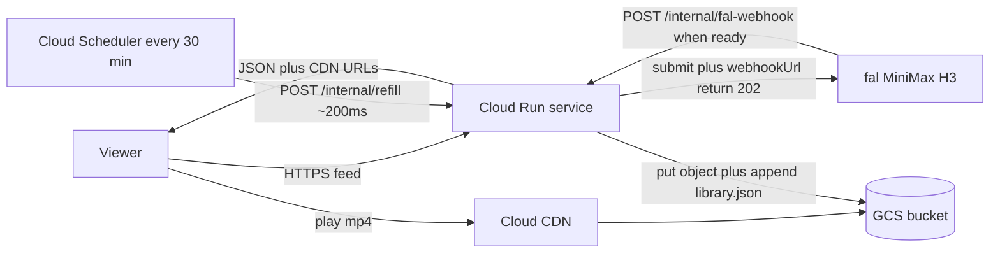
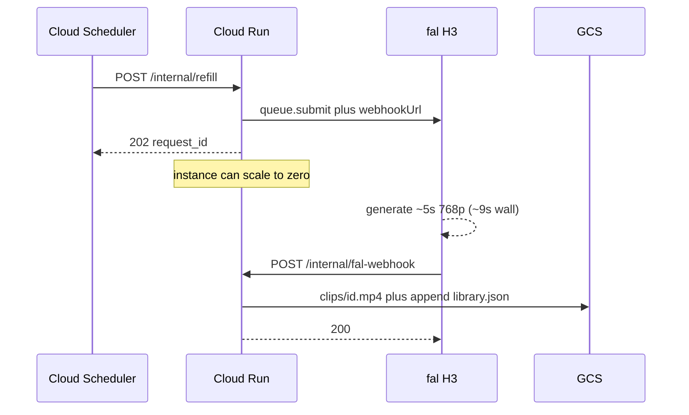

# SlopTok architecture

Joke vertical feed of AI video slop. The website is a tiny HTTP service. Generation is someone else's GPUs. We never sit in Cloud Run waiting for fal.

## What runs where

Cloud Run only handles short HTTP:

1. Feed/API for viewers.
2. `/internal/refill` (Scheduler): submit one H3 job to fal with `webhookUrl`, return 202. Do not poll.
3. `/internal/fal-webhook` (fal): download the mp4, upload to GCS, append `library.json`, return 200.

Fal holds the 5 to 10 seconds of GPU time. If Cloud Run polled, we would pay for idle instance time while fal worked. That is the thing we are not doing.

## Sequence (one new clip)

## Data

- **Bytes:** `gs://$SLOP_BUCKET/clips/{id}.mp4` (append-only library).
- **Catalog:** `library.json` in the same bucket (slot, prompt, handle, object name, model). First-fill target is 20 (`SLOP_POOL_SIZE`); refill appends slot `N`, never deletes.
- **Playback:** `https://$CDN_BASE_URL/clips/{id}.mp4` so Cloud Run is not a video origin.
- **Git:** `data/clips/` holds a 20-clip seed so a laptop can run without fal. Production should `gsutil rsync` that seed into the bucket once, then stop using git as object storage.

Local/dev still serves `/api/media/...` from disk. Production sets `CDN_BASE_URL` and `SLOP_BUCKET`.

## Secrets and identity

| Name | Where |
| --- | --- |
| `FAL_KEY` | Secret Manager, injected on Cloud Run |
| `WEBHOOK_SECRET` | Query token on the fal webhook URL |
| `SLOP_PUBLIC_URL` | Public HTTPS origin fal can POST |
| Scheduler OIDC | Invokes `/internal/refill` as the service account |

The browser never sees `FAL_KEY`.

## Cost (list prices, us-central1 / North America, Aug 2026)

Dominant line is **fal**, then **CDN egress** if people actually watch. Cloud Run and GCS storage are rounding error at this scale.

### Generation (fal MiniMax H3)

- Rate: **$0.06/s at 768P** on fal (`minimax/h3/text-to-video`), 5s clip → **$0.30/clip**.
- Source: [fal H3 model page](https://fal.ai/models/minimax/h3/text-to-video).
- First fill of 20: **~$6** (already spent; seed is in git).
- Scheduler every 30 minutes, 24/7: 48 clips/day × $0.30 = **~$14.40/day** (~$432/month).
- Same cadence, 12h/day: **~$7.20/day** (~$216/month).
- One clip per hour: 24/day × $0.30 = **~$7.20/day**.

Turn the Scheduler down if you do not want a $400 fal bill. The website does not care; it just reads the library.

### Egress (watching)

Measured on the 20 committed H3 mp4s: **average 2.83 MiB** per full 5s play (min 1.4 MiB, max 6.7 MiB).

| Path | Rate | One full play | 15-play session | ~11 min of full 5s clips (~130 plays) |
| --- | --- | --- | --- | --- |
| Cloud CDN NA, first 10 TiB | $0.08/GiB | **$0.00022** | **$0.0033** | **$0.029** |
| GCS internet Premium | $0.12/GiB | $0.00033 | $0.0050 | $0.043 |

Sources: [Cloud CDN pricing](https://cloud.google.com/cdn/pricing) (NA cache data transfer out $0.08/GiB; NA cache fill $0.01/GiB on misses). [GCS / network](https://cloud.google.com/storage/pricing) Premium internet $0.12/GiB first 10 TiB. Cache lookups are $0.0075/10k (~$0.00000075/play), ignored.

"15-play session" is a normal TikTok-shaped session (about 10–11 minutes and 12–18 videos in 2025/26 public stats), assuming each of *our* 5s clips is watched to the end. Skipping is cheaper. 1,000 such sessions/day on CDN ≈ **$3.30/day** of egress.

### Cloud Run (why we do not poll)

Request-based billing, us-central1: **$0.000024 per vCPU-second** active, **$0.0000025 per GiB-second**, **$0.40 per million requests** after 2M free. Source: [Cloud Run pricing](https://cloud.google.com/run/pricing). Time rounded up to 100ms. Scale-to-zero; no min instances.

Assume 1 vCPU, 512 MiB, two requests per new clip (submit ~200ms, webhook ~1.5s including GCS put):

- CPU: (0.2 + 1.5) × $0.000024 ≈ **$0.000041 per clip**
- RAM: 1.7 × 0.5 × $0.0000025 ≈ **$0.000002**
- 1,440 clips/month: **~$0.06** compute, well inside the free tier (180k vCPU-seconds / 2M requests).

If we **polled** fal for ~9s of wall time on the instance instead:

- CPU: 9 × $0.000024 ≈ **$0.00022 per clip** (~5× the webhook design)
- Still cheap in absolute dollars at 48 clips/day, but it is idle money, it holds a billable instance the whole generate, and it gets worse with min-instances or CPU-always-allocated. Do not do it.

Webhook download of a 3 MiB mp4 from fal plus upload to GCS is in-region to GCS (no GCP egress) and a few seconds of Cloud Run, already in the 1.5s above.

### Scheduler, storage, secrets

- **Cloud Scheduler:** 3 jobs free per month, then **$0.10 per job per month**. One 30-minute job is free. ([Scheduler pricing](https://cloud.google.com/scheduler/pricing))
- **GCS Standard regional:** **$0.020/GB-month**. 20 clips ≈ 56 MiB ≈ **$0.001/month**. At 1,000 clips (~2.8 GB) ≈ **$0.06/month**. ([Storage pricing](https://cloud.google.com/storage/pricing))
- **Secret Manager / Artifact Registry / Cloud Load Balancing:** ignore until you are actually serving serious traffic. Data transfer from Cloud Run to Cloud CDN/GCS in-region is not billed as internet egress.

### Monthly sketch

Assumptions: us-central1, NA viewers, CDN hit after first play, Scheduler every 30 minutes *12 hours/day* (24 clips/day), 200 sessions/day × 15 full plays, library grows ~720 clips/month after a 20-clip seed.

| Line | Rough |
| --- | --- |
| fal H3 (24 × 30 × $0.30) | **~$216** |
| CDN egress (200 × 15 × $0.00022 × 30) | **~$20** |
| Cloud Run | **~$0** (free tier) |
| GCS storage | **~$0.02** |
| Scheduler | **~$0** |
| **Total** | **~$236/month**, almost all fal |

Cut Scheduler to hourly and fal drops from ~$216 to **~$108/month**. Watch traffic does not move the bill until you have thousands of sessions per day.

## What we are not running

- No GKE, no GPU VMs, no Cloud Run **Jobs** that sleep on fal (Jobs bill for the whole instance lifetime, 1 minute minimum).
- No always-on worker pool.
- No video bytes through Cloud Run in production.

## Deploy sketch

1. Bucket plus public-read or CDN backend bucket on `clips/`.
2. Cloud CDN in front of the bucket; set `CDN_BASE_URL`.
3. Cloud Run service from the Dockerfile (do not COPY `data/clips`).
4. `gsutil rsync data/clips gs://$SLOP_BUCKET/clips` once for the seed.
5. Cloud Scheduler OIDC → `POST $SLOP_PUBLIC_URL/internal/refill` every 30 minutes.
6. Secrets: `FAL_KEY`, `WEBHOOK_SECRET`.
