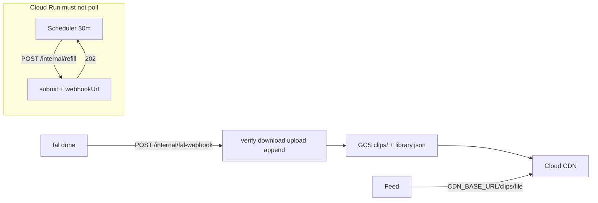

# SlopTok architecture

Verbal picture first, then diagrams, then money.

## What it is

A joke vertical feed of MiniMax H3 clips. The library is **append-only**: refill adds a clip; nothing is deleted. The first 20 mp4s are committed under `data/clips` so a fresh deploy does not have to call fal to play something.

## HTTP-only Cloud Run (do not poll fal)

The Cloud Run **service is HTTP only**. It must **never wait on fal**. Waiting costs money: a 9s H3 job spent in `pollUntilDone` would bill Cloud Run CPU for those 9s, every refill.

Production split:

1. **Cloud Scheduler** POSTs `/internal/refill` every 30 minutes (OIDC to the service).
2. That handler submits **one** H3 job to fal **with** `webhookUrl`, then returns **202 immediately**.
3. When fal finishes, it POSTs `/internal/fal-webhook`. The handler verifies, downloads the mp4, uploads GCS, **appends** `library.json` (never deletes old clips), returns **200**.
4. The browser in production plays `${CDN_BASE_URL}/clips/{file}` from Cloud CDN. Local dev can still use `/api/media`.

Seed mp4s are **not** copied into the Docker image (`.dockerignore` `data`). Sync them with `gsutil rsync data/clips gs://$SLOP_BUCKET/clips`.

```mermaid
sequenceDiagram
  participant Sch as Cloud Scheduler
  participant Run as Cloud Run (HTTP)
  participant Fal as fal queue
  participant GCS as GCS bucket
  participant CDN as Cloud CDN
  participant Bro as Browser

  Sch->>Run: POST /internal/refill (OIDC)
  Run->>Fal: submit H3 + fal_webhook
  Run-->>Sch: 202 (no poll)
  Note over Run: instance can scale to zero
  Fal->>Run: POST /internal/fal-webhook
  Run->>Fal: download mp4 URL
  Run->>GCS: put clips/{file}; append library.json
  Run-->>Fal: 200
  Bro->>Run: GET /api/feed
  Run-->>Bro: videoUrl = CDN_BASE_URL/clips/{file}
  Bro->>CDN: GET /clips/{file}
  CDN->>GCS: origin miss
  CDN-->>Bro: mp4
```



## Local vs production media

| | Local | Production |
| --- | --- | --- |
| Clips | `data/clips/*.mp4` via `/api/media/{file}` | GCS `clips/{file}` via `${CDN_BASE_URL}/clips/{file}` |
| Library | `data/clips/manifest.json` | GCS `library.json` |
| Refill cadence | optional `SLOP_REFRESH_MS` while the feed is used | Scheduler only; feed path does not mint T2V |
| fal wait | queue poll is allowed on a laptop | **forbidden** on Cloud Run |

Env (no secrets in git): `FAL_KEY`, `SLOP_BUCKET`, `CDN_BASE_URL`, `SLOP_PUBLIC_URL`, `WEBHOOK_SECRET`.

## Cost, with bases

Bases used below:

- **H3** MiniMax text-to-video **$0.30 / 5s / 768P** (fal list price used here).
- **Clip size** average **2.8 MiB** from the 20 committed starter mp4s.
- **Cloud CDN** North America egress **$0.08 / GiB**.
- **GCS** premium network egress **$0.12 / GiB** (origin fill / uncached).
- **GCS storage** **$0.02 / GB-month**.
- **Cloud Run** billed only for **two short HTTP requests per refill** (submit 202 + webhook 200), **not** fal poll time.
- **Cloud Scheduler** about **$0.10 / job / month** after the 3 jobs/month free tier.

### Dominant cost: fal generation

If Scheduler fires every 30 minutes **24/7**:

- 48 jobs/day × **$0.30** = **~$14.40/day** (~$432/month) of H3.

That dwarfs infra. Pause or slow the job if you do not want a clip every half hour.

### Infra (order of magnitude, not a quote)

Assume 48 new clips/day, 2.8 MiB each, library never shrinks.

| Line | Sketch | Notes |
| --- | --- | --- |
| GCS storage | 20×2.8 MiB seed ≈ 56 MiB; +134 MiB/day | ~$0.02/GB-month → **pennies**. 1 month ≈ 4 GiB ≈ **$0.08**. |
| CDN egress | viewers × 2.8 MiB × $0.08/GiB | 10k plays ≈ 27.3 GiB × $0.08 ≈ **$2.20**. |
| GCS egress | only CDN misses / first fill | $0.12/GiB; with CDN hit rate high this stays small. |
| Cloud Run | 96 HTTP calls/day, seconds each | CPU/RAM billed for request time only because we **do not poll**. |
| Scheduler | 1 job | **~$0.10/month** after free tier. |

Cloud Run would dominate infra **only if** the service blocked on fal (~9s measured H3). That is why refill returns 202 and the webhook is a separate request.

### First fill vs steady state

`SLOP_POOL_SIZE` is the first-fill **target** (20 × $0.30 ≈ **$6**), not a cap. After that, cost is pennies of GCS/CDN plus **$0.30 per appended clip**.
